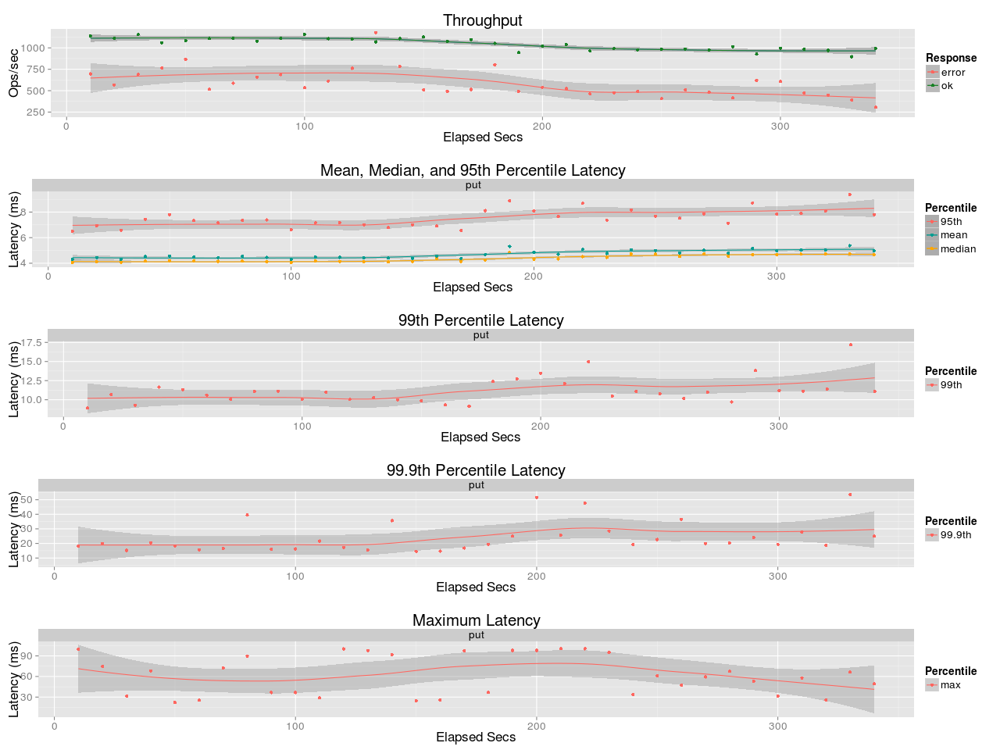
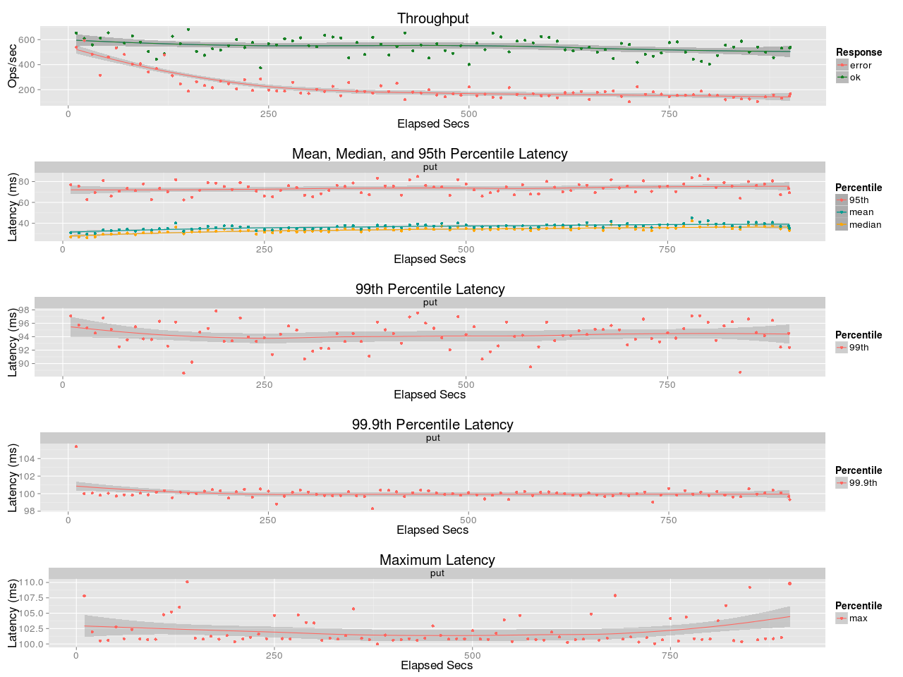

An *Erlang* version of [Redis](http://redis.io), with the goal of similar algorithmic performance but support for multiple master nodes and larger-than-RAM datasets. For [More info](http://inakanetworks.com/assets/pdf//Edis_Implementing_Redis_In_Erlang.pdf), see this PDF of a Talk at Erlang Factory 2012.

## Contact Us
For **questions** or **general comments** regarding the use of this library, please use our public
[hipchat room](https://www.hipchat.com/gpBpW3SsT).

If you find any **bugs** or have a **problem** while using this library, please [open an issue](https://github.com/inaka/edis/issues/new) in this repo (or a pull request :)).

And you can check all of our open-source projects at [inaka.github.io](http://inaka.github.io)

## Usage
Just run `$ make run` and open connections with your favourite redis client.

## Differences with Redis
### Different Behaviour
* _SAVE_, _BGSAVE_ and _LASTSAVE_ are database dependent. The original Redis saves all databases at once, edis saves just the one you _SELECT_'ed.
* _INFO_ provides much less information and no statistics (so, _CONFIG RESETSTAT_ does nothing at all)
* _MULTI_ doesn't support:
  - cross-db commands (i.e. _FLUSHALL_, _SELECT_, _MOVE_)
  - non-db commands (i.e _AUTH_, _CONFIG *_, _SHUTDOWN_, _MONITOR_)
  - pub/sub commands (i.e. _PUBLISH_, _SUBSCRIBE_, _UNSUBSCRIBE_, _PSUBSCRIBE_, _PUNSUBSCRIBE_)
* _(P)UNSUBSCRIBE_ commands are not allowed outside _PUBSUB_ mode
* _PUBLISH_ response is not precise: it's the amount of all clients subscribed to any channel and/or pattern, not just those that will handle the message. On the other hand it runs in _O(1)_ because it's asynchronous, it just dispatches the message.

### Missing Features
* Dynamic node configuration (i.e. the _SLAVEOF_ command is not implemented)
* Encoding optimization (i.e. all objects are encoded as binary representations of erlang terms, so for instance "123" will never be stored as an int)
* _OBJECT REFCOUNT_ allways returns 1 for existing keys and (nil) otherwise

### Unsupported Commands
_SYNC_, _SLOWLOG_, _SLAVEOF_, _DEBUG *_

### License
edis is licensed by Electronic Inaka, LLC under the Apache 2.0 license; see the LICENSE file in this repository.

### TODO

* Backends
  * HanoiDB
    * Make use of the efficient range searchs with start/end for searching ranges
    * Make use of time-based key expiry
    * Finish the TODO items

## Issue
* [compile error](https://github.com/inaka/edis/issues/44)

## Benchmarking
### Operation: sadd
### Origin

### Synchronize
